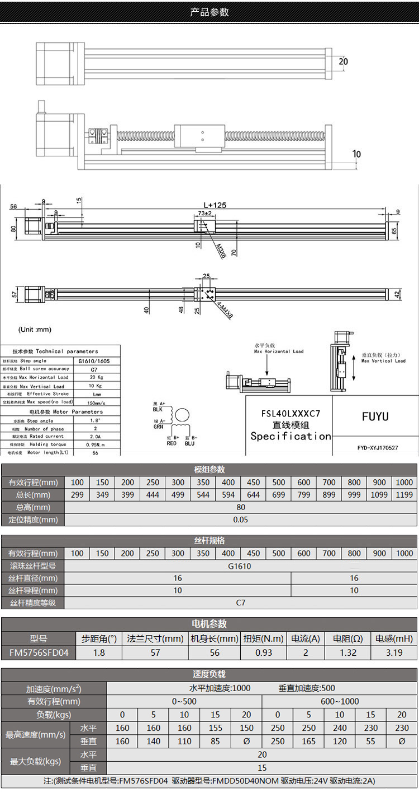
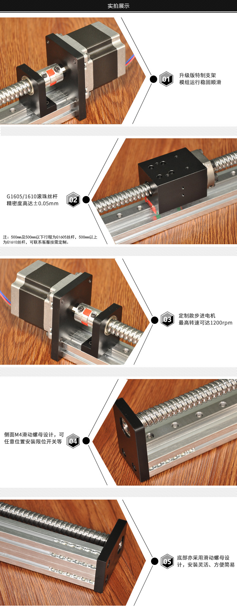
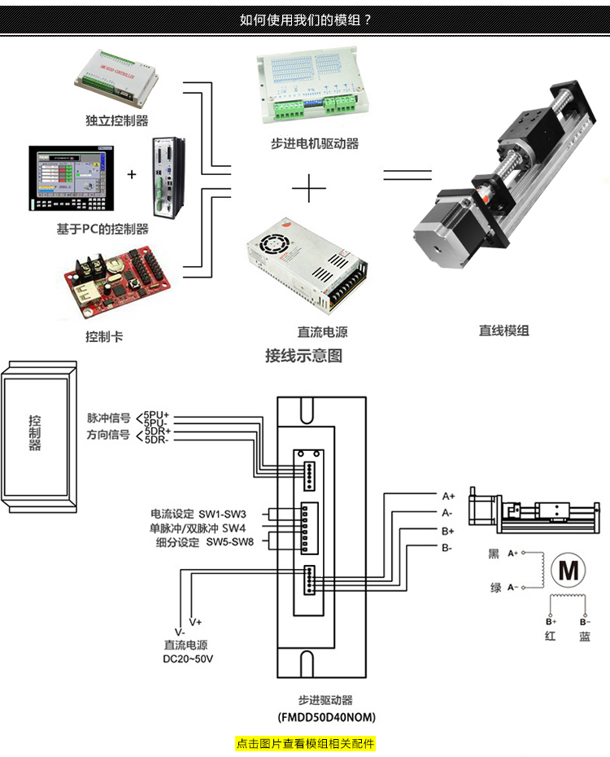

# 电动导轨

## 1. 硬件

STM32F103C8T6开发板一块（需要PB3-PB5共三个引脚引出，接步进电机）

淘宝电动导轨一个，详细技术文档见附录

## 2. 本项目功能

- 后台进程托管，记录滑块信息，防止撞边
- 提供易操作的网页端
- 提供c++和python操控例程

## 3. 安装方法

### 1. 单片机工程

使用CubeMX生成，目前有Keil5的项目，使用者可以根据自己的工具链用CubeMX生成别的工程，并自行修复编译链接等问题

编译好的单片机程序烧录进单片机，插上USB接口应当在设备管理器中（或`/dev/`下）看到一个USB串口，记住它，之后后台管理进程需要它来启动

### 2. 编译后台管理进程

#### 依赖安装

需要mosquitto客户端库（也需要相应的服务器进程），Ubuntu下直接apt安装即可（如果源码编译需要在`config.mk`中开启WebSocket支持，默认是不支持的）

## 4. 使用方法

安装好Mosquitto服务器，Host程序应当能连接上并正常运行

如果要使用WebGUI，还要合理配置Nginx以便浏览器能够为你提供服务

```nginx
# 配置mqtt的websocket反向代理
location ~ ^\/mqtt$ {
    proxy_pass http://127.0.0.1:9000;
    proxy_http_version 1.1;
    proxy_set_header Upgrade $http_upgrade;
    proxy_set_header Connection "upgrade";
}
# 配置你的网站到本项目目录下的SteppingMotorGUI文件夹，这可能并不是最好的配置，但能用~
location ~ ^\/steppingmotor(.*)$ {
    root /home/wuyue/nextcloud/geeklab/Softio/SteppingMotorGUI;
    try_files $1 $1index.html =404;
}
```


## 附录A：电动导轨参数

购买链接：<https://detail.tmall.com/item.htm?id=559982354784>





